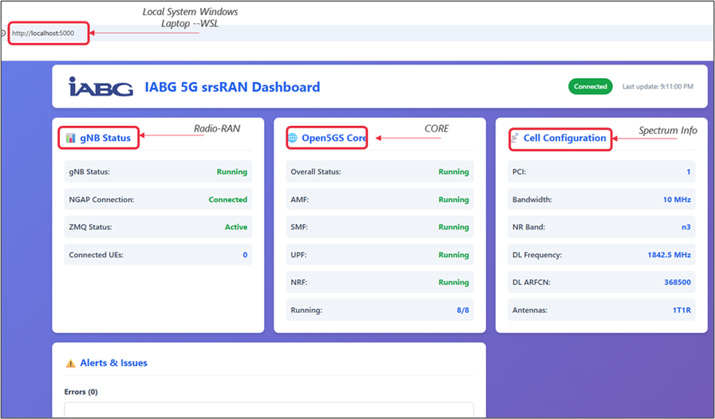

# IABG 5G srsRAN Dashboard

<div align="center">
  
  
  **Real-time monitoring dashboard for srsRAN Project gNB**
  
  [](https://www.docker.com/)
  [](https://www.python.org/)
  [](LICENSE)
  [](https://www.iabg.de/)
</div>

---

## 📋 Table of Contents

- [Overview](#overview)
- [Features](#features)
- [Screenshots](#screenshots)
- [Architecture](#architecture)
- [Installation](#installation)
  - [Prerequisites](#prerequisites)
  - [Build Tools and Dependencies](#build-tools-and-dependencies)
  - [Install srsRAN Project](#install-srsran-project)
  - [Install Open5GS Core](#install-open5gs-core)
  - [Install Dashboard](#install-dashboard)
- [Configuration](#configuration)
- [Deployment](#deployment)
  - [Docker Deployment](#docker-deployment)
  - [Manual Deployment](#manual-deployment)
- [Usage](#usage)
- [API Documentation](#api-documentation)
- [Troubleshooting](#troubleshooting)
- [Future Enhancements](#future-enhancements)
- [Contributing](#contributing)
- [License](#license)
- [Contact](#contact)

---

## 🎯 Overview

The **IABG 5G srsRAN Dashboard** is a professional real-time monitoring solution for srsRAN Project gNB (5G base stations). Developed by the IABG 5G Division for defense and aerospace applications, it provides comprehensive visibility into:

- gNB operational status and health
- 5G core network connectivity (NGAP)
- Cell configuration and RF parameters
- UE connections and session management
- Real-time error and warning tracking
- ZMQ RF simulator status

Built for **mission-critical 5G deployments** including BDBOS KOMET, ESA ARTES, and private 5G networks.

---

## ✨ Features

### Real-time Monitoring
- ⚡ **Live updates** every 2 seconds
- 📊 **gNB status tracking** - Cell configuration, NGAP connection, ZMQ status
- 📡 **Cell information** - PCI, bandwidth, band, frequency, antennas
- 👥 **UE management** - Track connected users
- 🔴 **Alert system** - Visual indicators for errors and warnings

### Professional Interface
- 🎨 **IABG branding** with company logo
- 📱 **Responsive design** - Works on desktop, tablet, mobile
- 🌐 **Web-based** - Access from any browser
- 🔄 **Auto-refresh** - No manual intervention needed

### Log Analysis
- 📝 **Intelligent parsing** of srsRAN gNB logs
- 🔍 **Event extraction** - Cell startup, NGAP events, UE attachments
- 📈 **Metrics aggregation** - Historical error/warning tracking
- 💾 **PCAP integration** - Links to packet captures

### API & Integration
- 🔌 **REST API** - JSON endpoints for external tools
- 🐳 **Docker support** - Containerized deployment
- 🔧 **Configurable** - Customize log paths, update intervals
- 📊 **Export ready** - Structured data for analysis

---

## 📸 Screenshots

### Complete Dashboard View

*Complete dashboard showing gNB status (Radio-RAN), Open5GS Core services, and Cell Configuration (Spectrum Info)*

**Dashboard Features:**
- **Radio-RAN (gNB)**: Running status, NGAP connected to AMF, ZMQ active, 0 UEs
- **CORE (Open5GS)**: All 8 services running (AMF, SMF, UPF, NRF, etc.) - 8/8 green
- **Spectrum Info (Cell)**: PCI=1, 10MHz bandwidth, Band n3, 1842.5 MHz, ARFCN 368500, 1T1R antennas

### Dashboard Overview

*Main dashboard showing gNB status, cell configuration, and alerts*

### Cell Configuration

*Detailed 5G NR cell parameters*

### Alerts & Events

*Real-time error and warning tracking*

---

## 🏗️ Architecture

```
┌─────────────────────────────────────────────────────────────┐
│                    IABG 5G srsRAN Dashboard                 │
│                    (Flask Web Application)                   │
│  ┌─────────────┐  ┌──────────────┐  ┌──────────────────┐  │
│  │   Parser    │  │  REST API    │  │  Web Interface   │  │
│  │   Engine    │  │  Endpoints   │  │  (HTML/CSS/JS)   │  │
│  └──────┬──────┘  └──────────────┘  └──────────────────┘  │
│         │                                                    │
└─────────┼────────────────────────────────────────────────────┘
          │
          ▼
    /tmp/gnb.log ◄──────────────┐
          │                      │
          ▼                      │
┌──────────────────────┐         │
│   srsRAN Project     │         │
│   gNB (5G SA)        │─────────┘
│                      │
│  ┌────────────────┐  │
│  │  ZMQ RF Sim    │  │
│  └────────────────┘  │
│                      │
│  NGAP (N2) ──────────┼─────────┐
│  GTP-U (N3) ─────────┼─────┐   │
└──────────────────────┘     │   │
                             │   │
                             ▼   ▼
                    ┌─────────────────┐
                    │   Open5GS       │
                    │   5G Core       │
                    │                 │
                    │  AMF │ SMF │ UPF│
                    └─────────────────┘
```

**Components:**
- **Dashboard**: Flask-based web application with real-time log parsing
- **srsRAN gNB**: 5G base station (NR SA mode)
- **Open5GS**: 5G core network (AMF, SMF, UPF, etc.)
- **ZMQ**: RF simulator for testing without hardware

---

## 🚀 Installation

### Prerequisites

**System Requirements:**
- Ubuntu 24.04 LTS (or 22.04)
- WSL2 (for Windows) or native Linux
- 8GB RAM minimum
- 20GB free disk space

**Software:**
- Python 3.8+
- Docker (optional, for containerized deployment)
- Git

### Build Tools and Dependencies

```bash
# Update system
sudo apt update && sudo apt upgrade -y

# Install build essentials (Ubuntu 24.04)
sudo apt install -y build-essential cmake libfftw3-dev libmbedtls-dev \
  libboost-program-options-dev libconfig++-dev libsctp-dev libtool \
  autoconf libzmq3-dev git libuhd-dev uhd-host libpcsclite-dev \
  libgnutls28-dev libssl-dev libyaml-cpp-dev libpthread-stubs0-dev \
  pkg-config curl gnupg
```

### MongoDB (for Open5GS)

```bash
# Add MongoDB repository (Ubuntu 22.04 compatible)
curl -fsSL https://www.mongodb.org/static/pgp/server-7.0.asc | \
  sudo gpg -o /usr/share/keyrings/mongodb-server-7.0.gpg --dearmor

echo "deb [ arch=amd64,arm64 signed-by=/usr/share/keyrings/mongodb-server-7.0.gpg ] \
  https://repo.mongodb.org/apt/ubuntu jammy/mongodb-org/7.0 multiverse" | \
  sudo tee /etc/apt/sources.list.d/mongodb-org-7.0.list

# Install MongoDB
sudo apt update
sudo apt install -y mongodb-org

# Start MongoDB
sudo systemctl start mongod
sudo systemctl enable mongod

# Verify
mongod --version
```

### Install srsRAN Project

```bash
# Create working directory
mkdir -p /mnt/c/TouchdownOld/srsran5g
cd /mnt/c/TouchdownOld/srsran5g

# Clone srsRAN Project
git clone https://github.com/srsran/srsRAN_Project.git
cd srsRAN_Project

# Build with ZMQ support
mkdir build && cd build
cmake ../ -DENABLE_EXPORT=ON -DENABLE_ZEROMQ=ON
make -j$(nproc)
sudo make install
sudo ldconfig

# Verify installation
gnb --version
```

### Install Open5GS Core

```bash
# Add Open5GS repository
sudo add-apt-repository ppa:open5gs/latest -y
sudo apt update

# Install Open5GS
sudo apt install -y open5gs

# Start core network functions
sudo systemctl start open5gs-amfd open5gs-smfd open5gs-upfd \
  open5gs-nrfd open5gs-ausfd open5gs-udmd open5gs-pcfd \
  open5gs-bsfd open5gs-udrd

# Verify AMF is running
sudo systemctl status open5gs-amfd
```

### Install Dashboard

```bash
cd /mnt/c/TouchdownOld/srsran5g

# Clone dashboard repository
git clone https://github.com/shariquetelco/srs-5g-dashboard.git
cd srs-5g-dashboard

# Install Python dependencies
pip install -r requirements.txt --break-system-packages
```

---

## ⚙️ Configuration

### Configure Subscriber in Open5GS

Add a test UE to the database:

```bash
sudo open5gs-dbctl add 001010123456780 \
  00112233445566778899aabbccddeeff \
  63bfa50ee6523365ff14c1f45f88737d
```

**Subscriber Details:**
- IMSI: `001010123456780`
- Key: `00112233445566778899aabbccddeeff`
- OPc: `63bfa50ee6523365ff14c1f45f88737d`

### Create gNB Configuration

```bash
mkdir -p configs
cd configs
nano gnb_zmq.yml
```

**gnb_zmq.yml:**
```yaml
# gNB configuration for ZMQ simulation
cu_cp:
  amf:
    addr: 127.0.0.5
    port: 38412
    bind_addr: 127.0.0.1
    supported_tracking_areas:
      - tac: 7
        plmn_list:
          - plmn: "00101"
            tai_slice_support_list:
              - sst: 1

ru_sdr:
  device_driver: zmq
  device_args: tx_port=tcp://127.0.0.1:2000,rx_port=tcp://127.0.0.1:2001,base_srate=11.52e6
  srate: 11.52
  tx_gain: 75
  rx_gain: 75

cell_cfg:
  dl_arfcn: 368500
  band: 3
  channel_bandwidth_MHz: 10
  common_scs: 15
  plmn: "00101"
  tac: 7
  pdcch:
    common:
      ss0_index: 0
      coreset0_index: 6
    dedicated:
      ss2_type: ue_dedicated
      dci_format_0_1_and_1_1: true
  prach:
    prach_config_index: 1

log:
  filename: /tmp/gnb.log
  all_level: info

pcap:
  mac_enable: true
  mac_filename: /tmp/gnb_mac.pcap
  ngap_enable: true
  ngap_filename: /tmp/gnb_ngap.pcap
```

---

## 🐳 Deployment

### Docker Deployment (Recommended)

**Build and run:**
```bash
cd srs-5g-dashboard

# Build Docker image
docker build -t iabg-srsran-dashboard .

# Run with docker-compose
docker-compose up -d

# Check status
docker ps

# View logs
docker logs iabg-srsran-dashboard

# Stop
docker-compose down
```

**Access dashboard:**
```
http://localhost:5000
```

### Manual Deployment

**Terminal 1 - Dashboard:**
```bash
cd /mnt/c/TouchdownOld/srsran5g/srs-5g-dashboard
python3 app.py
```

**Terminal 2 - gNB:**
```bash
cd /mnt/c/TouchdownOld/srsran5g/configs
sudo gnb -c gnb_zmq.yml
```

**Terminal 3 - Add startup messages to log:**
```bash
echo "Cell pci=1, bw=10 MHz, 1T1R, dl_arfcn=368500 (n3), dl_freq=1842.5 MHz, dl_ssb_arfcn=368410, ul_freq=1747.5 MHz" | sudo tee -a /tmp/gnb.log
echo "N2: Connection to AMF on 127.0.0.5:38412 completed" | sudo tee -a /tmp/gnb.log
```

---

## 📖 Usage

### Starting the System

1. **Start Dashboard:**
   ```bash
   python3 app.py
   ```
   Dashboard available at: `http://localhost:5000`

2. **Start gNB:**
   ```bash
   sudo gnb -c gnb_zmq.yml
   ```

3. **Populate Dashboard:**
   The dashboard automatically parses `/tmp/gnb.log` every 2 seconds.

### Dashboard Features

- **System Status Card**: gNB status, NGAP connection, ZMQ status, connected UEs
- **Cell Configuration Card**: PCI, bandwidth, band, frequency, ARFCN, antennas
- **Alerts & Issues**: Real-time error and warning tracking
- **Recent Events**: UE attachments, NGAP events, system state changes
- **System Summary**: Text-based summary of current state

### Monitoring

The dashboard updates automatically. No manual refresh needed.

**Status Indicators:**
- 🟢 **Green**: Running/Connected/Active
- 🟡 **Yellow**: Unknown/Waiting
- 🔴 **Red**: Error/Disconnected/Failed

---

## 🔌 API Documentation

### Base URL
```
http://localhost:5000/api
```

### Endpoints

#### GET /api/metrics
Returns current gNB metrics.

**Response:**
```json
{
  "status": "running",
  "cell_info": {
    "pci": "1",
    "bandwidth_mhz": "10",
    "band": "3",
    "dl_freq_mhz": "1842.5",
    "dl_arfcn": "368500",
    "tx_antennas": "1",
    "rx_antennas": "1"
  },
  "ngap_status": "connected",
  "zmq_status": "active",
  "ue_connections": 0,
  "errors": [],
  "warnings": [],
  "last_update": "2025-12-27T18:30:00"
}
```

#### GET /api/events
Returns recent events.

**Response:**
```json
{
  "events": [
    {
      "timestamp": "2025-12-27T18:29:45",
      "type": "cell_start",
      "data": {"pci": "1", "bandwidth_mhz": "10"}
    },
    {
      "timestamp": "2025-12-27T18:29:46",
      "type": "ngap_connected",
      "data": {"amf_ip": "127.0.0.5", "amf_port": "38412"}
    }
  ],
  "count": 2,
  "timestamp": "2025-12-27T18:30:00"
}
```

#### GET /api/summary
Returns text summary.

**Response:**
```json
{
  "summary": "Status: running | NGAP: connected | Connected UEs: 0 | Cell: PCI=1, BW=10MHz, Band n3 | Errors: 0 | Warnings: 0",
  "timestamp": "2025-12-27T18:30:00"
}
```

#### GET /api/health
Health check endpoint.

**Response:**
```json
{
  "status": "ok",
  "monitoring": true,
  "log_file": "/tmp/gnb.log",
  "log_exists": true,
  "timestamp": "2025-12-27T18:30:00"
}
```

---

## 🔧 Troubleshooting

### Dashboard shows "Waiting for gNB"
**Cause:** gNB not running or log file doesn't exist.
**Solution:**
1. Check if gNB is running: `ps aux | grep gnb`
2. Verify log file exists: `ls -la /tmp/gnb.log`
3. Check log file permissions: `sudo chmod 644 /tmp/gnb.log`

### No cell information displayed
**Cause:** Startup messages not in log file.
**Solution:**
```bash
echo "Cell pci=1, bw=10 MHz, 1T1R, dl_arfcn=368500 (n3), dl_freq=1842.5 MHz" | sudo tee -a /tmp/gnb.log
echo "N2: Connection to AMF on 127.0.0.5:38412 completed" | sudo tee -a /tmp/gnb.log
```

### gNB fails to start - Port 2152 in use
**Cause:** Another process using GTP-U port.
**Solution:**
```bash
sudo lsof -i :2152
sudo kill <PID>
# Or restart Open5GS
sudo systemctl restart open5gs-upfd
```

### Dashboard shows "Parser error"
**Cause:** Code bug in log parser.
**Solution:**
1. Check parser code: `nano parsers/gnb_parser.py`
2. Verify line 96 has: `lines = f.readlines()[-10000:]` (with colon)
3. Restart dashboard

### Docker container won't start
**Cause:** Port 5000 already in use.
**Solution:**
```bash
# Stop non-Docker dashboard
pkill -f "python3 app.py"
# Restart container
docker-compose up -d
```

---

## 🚧 Future Enhancements

### Planned Features

#### Phase 1 - Data Visualization
- [ ] Historical data charts (last 24 hours)
- [ ] Throughput graphs (DL/UL)
- [ ] UE connection timeline
- [ ] Resource block utilization

#### Phase 2 - Data Export
- [ ] Export metrics to CSV
- [ ] Generate PDF reports
- [ ] Prometheus metrics endpoint
- [ ] Grafana dashboard template

#### Phase 3 - Alerting
- [ ] Email notifications
- [ ] Slack integration
- [ ] Webhook support
- [ ] Custom alert rules

#### Phase 4 - Advanced Features
- [ ] Multiple gNB monitoring
- [ ] Comparison view
- [ ] Network slice tracking
- [ ] WebSocket for instant updates

#### Phase 5 - Enterprise Features
- [ ] User authentication
- [ ] Role-based access control
- [ ] Audit logging
- [ ] Backup/restore

---

## 🤝 Contributing

Contributions are welcome! Please follow these steps:

1. Fork the repository
2. Create feature branch: `git checkout -b feature/AmazingFeature`
3. Commit changes: `git commit -m 'Add AmazingFeature'`
4. Push to branch: `git push origin feature/AmazingFeature`
5. Open Pull Request

**Code Standards:**
- Python: PEP 8
- JavaScript: ES6+
- HTML/CSS: Semantic markup
- Comments: Clear and concise

---

## 📄 License

This project is licensed under the MIT License - see the [LICENSE](LICENSE) file for details.

---

## 📧 Contact

**Ahmad Sharique**
- Email: [ahmad@iabg.de](mailto:ahmad@iabg.de)
- Personal: [eshariq.am@gmail.com](mailto:eshariq.am@gmail.com)
- GitHub: [@shariquetelco](https://github.com/shariquetelco)
- GitLab (IABG): [Ahmad](https://gitlab.iabg.de/Ahmad)

**IABG mbH**
- Division: 5G & Aerospace
- Location: Munich, Germany
- Website: [www.iabg.de](https://www.iabg.de)

**Projects:**
- BDBOS KOMET: €500M+ mission-critical 5G deployment
- ESA ARTES: Satellite communications programs
- Private 5G networks for defense applications

---

## 🙏 Acknowledgments

- [srsRAN Project](https://www.srsran.com/) - Open source 5G RAN
- [Open5GS](https://open5gs.org/) - Open source 5G core network
- IABG 5G Division Team
- European Space Agency (ESA)
- German Federal Office of Civil Protection and Disaster Assistance (BBK/BDBOS)

---

<div align="center">
  <strong>Built with ❤️ for the 5G open source community</strong>
  <br>
  <em>© 2025 IABG mbH - All Rights Reserved</em>
</div>
